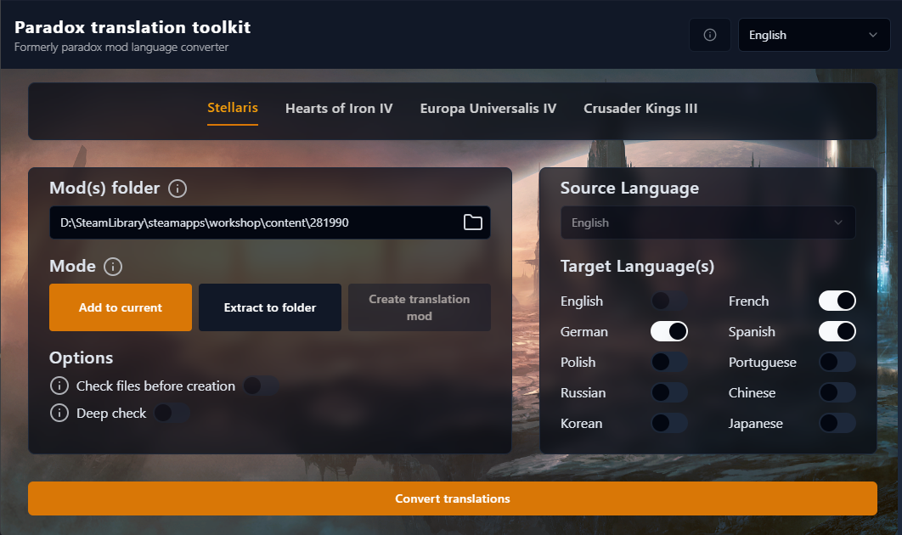

## Paradox Translation Toolkit

> A localisation file management tool for Paradox games.

- **Link**: https://github.com/khoeos/paradox-translation-toolkit/
- **Repository**: https://github.com/khoeos/paradox-translation-toolkit/
- **Platform**: Windows
- **Type**: Localisation Tool
- **Status**: Active
- **License**: CC BY-NC-SA 4.0
- **Language**: TypeScript

### Preview

The image below is loaded from the upstream README and remains hosted by the original project.

### Use case

Use this to generate missing localisation files for selected languages from an existing source language in Paradox game mods.

### Notes

The upstream project says it is mainly tested with Stellaris and is intended to work with multiple Paradox games. Check compatibility and release notes before using it for HOI4 workflows.
