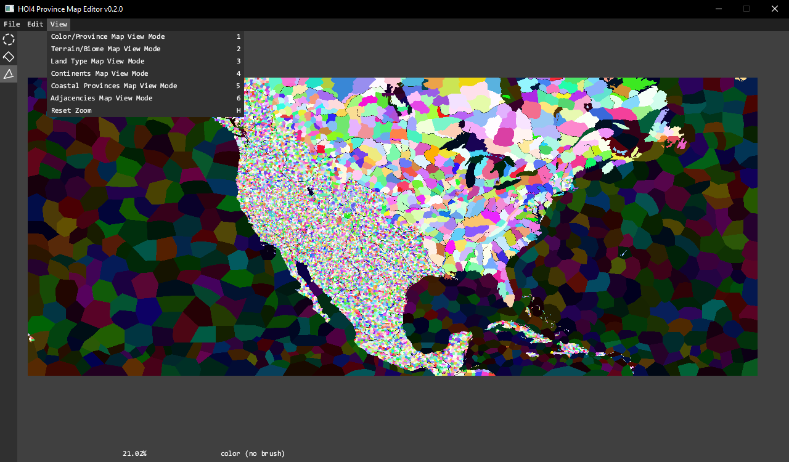
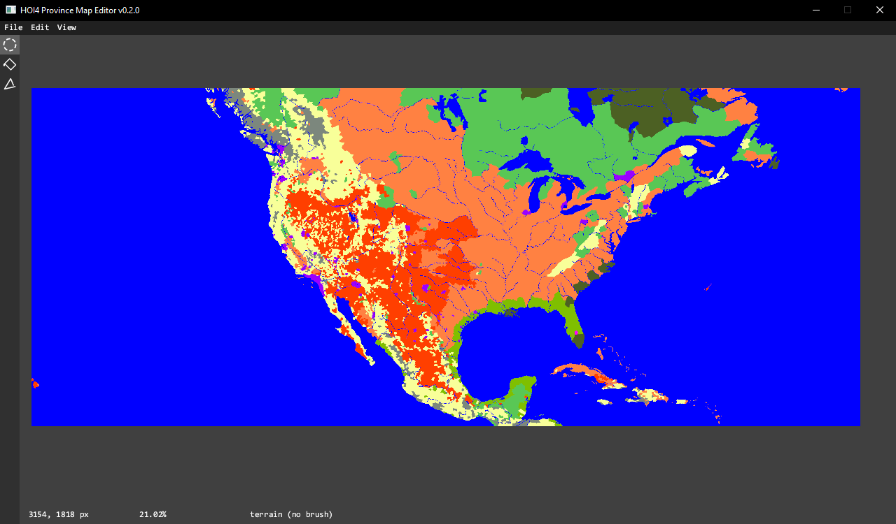

## HOI4 Province Editor

> 用于 HOI4 地图开发的省份编辑工具。

- **链接**: https://github.com/ScottyThePilot/hoi4_province_editor
- **仓库**: https://github.com/ScottyThePilot/hoi4_province_editor
- **平台**: Windows
- **类型**: 编辑器
- **状态**: 未确认
- **许可证**: 未确认

### 预览

以下图片来自上游 README，并由原项目托管。

### 使用场景

当你需要编辑省份或处理地图相关 Modding 任务时，可以参考这个工具。

### 备注

使用前请查看上游仓库，确认兼容性、安装方式和许可证信息。
